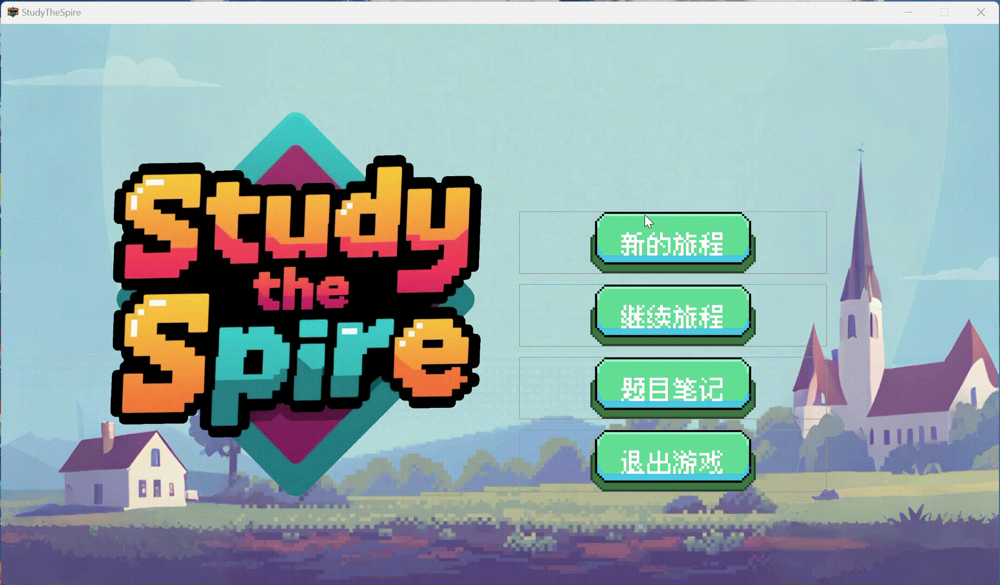
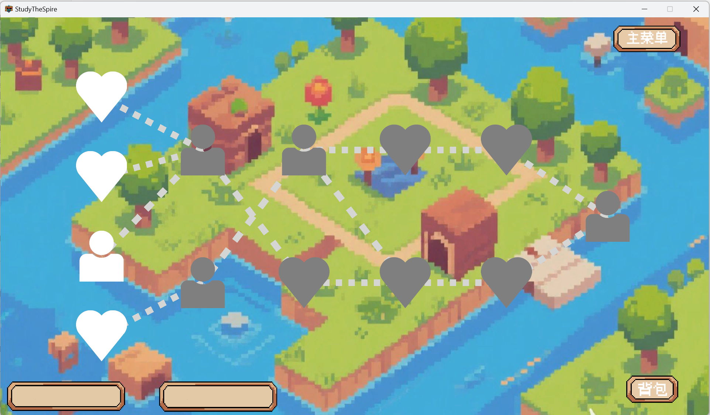
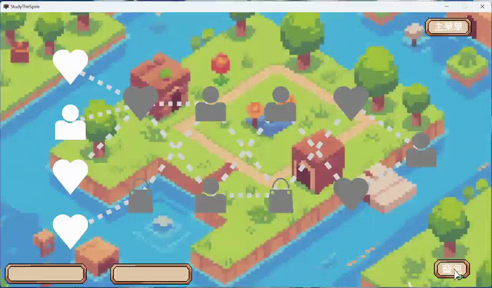

# Study-The-Spire

## 项目介绍

几个大学生的软件工程课程实践，欢迎试用

Study-The-Spire是一款带有一定科普性和学习性的游戏。玩家进入一个充满趣味与挑战的游戏世界，在探索剧情、完成任务的过程中，会触发嵌入式的知识问答关卡。在游戏内部接入了多种题库，每位玩家可以根据自己的兴趣和学习目标，自主选择不同主题的题库（如科学常识、历史文化、数学逻辑等，~~甚至包括二次元小知识~~），这些题目会自然融入关卡进程和休息房间中。答题正确能获得高额反馈，增强学习动力与成就感。游戏既保持娱乐性，又实现科普性内容的潜移默化传递。

## 一些demo

### 开始界面

   
       
     

### 组建队伍

### 地图场景

### 战斗场景

   
       
     

### 商店场景

### 背包场景

### 休息室

   
       
     

### 随机事件

### 题目回答

   
       
     

   
       
     

## 项目发布

- [软件发布链接](https://github.com/Mr-MysteryMan/Study-The-Spire/releases/tag/Final)
- [完整Demo演示链接](https://www.bilibili.com/video/BV1fXTizMEt1/?vd_source=5a5645ae4770b714297ef5a75136b132)